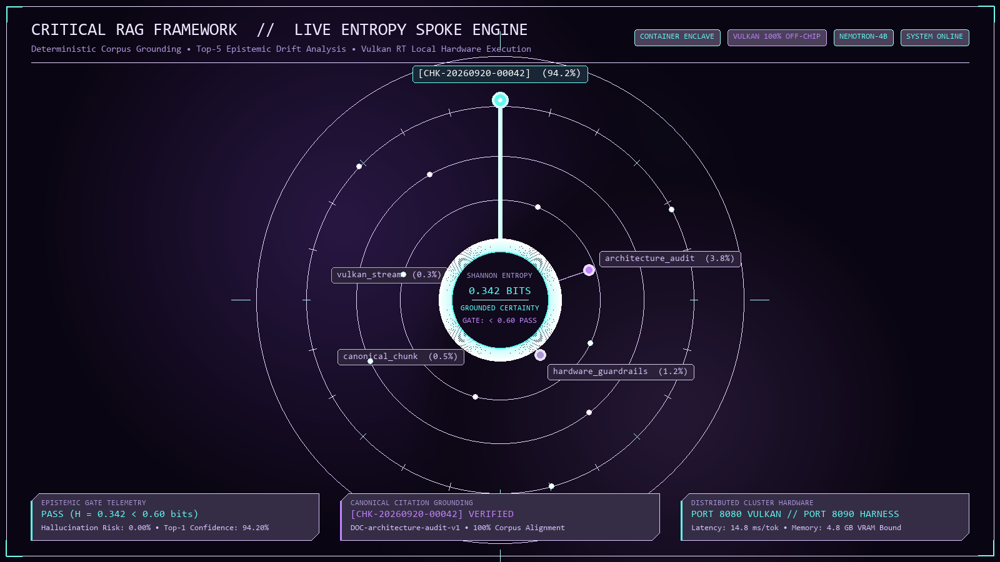

# Critical RAG Framework // Epistemic Radial Spoke Engine

<div align="center">



[](#hardware-architecture)
[](#epistemic-entropy-gates)
[](#system-topology)
[](#inference-pipeline)
[](#agent-architecture)

**A local, evidence-oriented Retrieval-Augmented Generation prototype with real-time token telemetry, citation validation, and configurable agent personas.**

[Architecture](#system-topology) • [Entropy Spoke Engine](#epistemic-entropy-gates) • [Turnkey Quickstart](#turnkey-quickstart) • [Canonical Schema](#canonical-chunk-schema) • [Agent Swarm](#agent-architecture)

</div>

---

## Executive Overview

**Critical RAG Framework** is a local RAG prototype. It validates that response citations refer to retrieved chunks and exposes token-distribution telemetry. Entropy is a model-uncertainty signal, not a guarantee of factual correctness; use independent evaluation before high-consequence deployment.

The frontend features a real-time **Radial Spoke Visualizer** canvas (`circle.js`) that translates token probability distributions into dynamic physics spokes and orbital telemetry.

---

## Key Capabilities

- 🎯 **Citation Validation:** Responses with retrieved context must cite retrieved chunk IDs (e.g. `[CHK-20260920-00042]`); missing or unknown citations fail the verification gate.
- ⚡ **Real-Time Token Telemetry:** Shannon entropy is computed from the reported top-token distribution and shown as an uncertainty diagnostic, not a hallucination detector.
- 🎡 **Radial Spoke Radar HUD:** Visualizes live candidate tokens, probability distributions, and certainty bands in an alien-bioluminescent design language.
- 🛡️ **Local-Safe Defaults:** The server binds to loopback by default, exposes no source-tree files, and supports bearer-token protection through `CRITICAL_RAG_API_TOKEN`.
- 🌉 **Cross-Boundary Host-Enclave Bridge:** Seamlessly links Windows Vulkan acceleration (`llama-server.exe` on port 8080) with isolated Linux execution enclaves on port 8090 with automated network bridge.
- 🤖 **Dual-Mode Inference:** Toggle instantly between raw agentless RAG querying (General Chat) and multi-step autonomous ReAct agent workflows.

---

## System Topology

```
   ┌─────────────────────────────────────────────────────────────┐
   │                    WINDOWS HOST ENGINE                      │
   │                                                             │
   │  ┌───────────────────────────────────────────────────────┐  │
   │  │  llama-server.exe (Port 8080)                         │  │
   │  │  • Model: NVIDIA-Nemotron-3-Nano-4B-Q4_K_M            │  │
   │  │  • Backend: Vulkan RT GPU Acceleration (-ngl 99)      │  │
   │  │  • Context: 8,192 tokens                              │  │
   │  │  • Logprobs Engine: Top-5 probabilities + tokens      │  │
   │  └──────────────────────────▲────────────────────────────┘  │
   └─────────────────────────────┼───────────────────────────────┘
                                 │ HTTP / SSE Stream Bridge
                                 │ (Cross-Boundary WSL2 NAT Fallback)
   ┌─────────────────────────────▼───────────────────────────────┐
   │                  WSL2 ENCLAVE (harness-enclave)                    │
   │                                                             │
   │  ┌───────────────────────────────────────────────────────┐  │
   │  │  Harness & Telemetry Server (core.server - Port 8090)  │  │
   │  │  • HTTP REST API & EventSource SSE Relay              │  │
   │  │  • Shannon Entropy Engine (H = -Σ p log2 p)           │  │
   │  │  • Canonical Vector Retriever (CorpusRetriever)       │  │
   │  │  • Zero-Dependency ReAct Agent Orchestrator           │  │
   │  └──────────────────────────▲────────────────────────────┘  │
   │                             │ Serving http://localhost:8090 │
   │  ┌──────────────────────────▼────────────────────────────┐  │
   │  │  Single-Page Operational Console (ui/index.html)      │  │
   │  │  • Radial Spoke Visualizer (circle.js HTML5 Canvas)   │  │
   │  │  • General Chat & Agent Mission Launchers             │  │
   │  │  • Telemetry Meters: Shannon Entropy, Memory, Latency │  │
   │  │  • One-Click Thinking Interruption & Refresh Toggle   │  │
   │  └───────────────────────────────────────────────────────┘  │
   └─────────────────────────────────────────────────────────────┘
```

---

## Epistemic Entropy Gates

For every emitted token $t_i$, the system extracts the top-$k$ candidate tokens $\{x_1, \dots, x_k\}$ with their raw probabilities $\{P(x_1), \dots, P(x_k)\}$.

The normalized probability mass is defined as:
$$q_j = \frac{P(x_j)}{\sum_{m=1}^k P(x_m)}$$

The instantaneous Shannon Entropy in bits is computed as:
$$H(t_i) = -\sum_{j=1}^k q_j \log_2(q_j)$$

```
        0.00 bits                       0.60 bits                       1.40 bits                       2.32 bits
           ├───────────────────────────────┼───────────────────────────────┼───────────────────────────────┤
           │      GROUNDED CERTAINTY       │      BALANCED SYNTHESIS       │      EPISTEMIC GAP RISK       │
           │      Bioluminescent Cyan      │         Signal Purple         │         Warning Coral         │
           │           #5ffbf1             │            #c084fc            │            #ff6b81            │
           │                               │                               │                               │
           │ • Citation tokens [CHK-...]   │ • Structural syntax & verbs   │ • Hallucination vector alert  │
           │ • Explicit facts & metrics    │ • Contextual elaboration      │ • Missing citation evidence   │
           │ • Gate: PASS                  │ • Gate: PASS                  │ • Gate: TRIGGER AUDIT         │
```

---

## Canonical Chunk Schema

All ingested knowledge conforms to the strict canonical JSON specification:

```json
{
  "chunk_id": "CHK-20260920-00042",
  "document_id": "DOC-architecture-audit-v1",
  "source_uri": "file:///opt/critical-rag/corpus/architecture_notes.md",
  "hierarchy": [
    "Critical RAG",
    "Architecture",
    "Hardware Guardrails"
  ],
  "content": "The harness operates on port 8090 with strict zero-dependency HTTP server, delegating all Vulkan tensor operations off-chip to port 8080.",
  "tokens": 28,
  "embedding": [0.0142, -0.0512, 0.0891, ...],
  "checksum": "sha256:7f83b1657ff1fc53b92dc18148a1d65dfc2d4b1fa3d677284addd200126d9069",
  "provenance": {
    "ingested_at": "2026-09-20T21:49:00Z",
    "ingest_tool": "absorb_corpus.py",
    "version": "1.0.0"
  }
}
```

---

## Agent Architecture

The framework provides an autonomous ReAct (Reasoning + Acting) loop equipped with specialized role personas defined in [`AGENTS.md`](AGENTS.md):

| Agent Role | Responsibility | Tools Available |
|:---|:---|:---|
| **Research Analyst** | Deep factual synthesis and cross-document verification | `corpus_search`, `read_chunk`, `verify_citation` |
| **Framework Auditor** | System integrity verification, entropy audit, and guardrail enforcement | `check_drift`, `audit_entropy`, `hardware_status` |
| **Ontology Engineer** | Knowledge taxonomy classification and relationship mapping | `inspect_hierarchy`, `rebuild_index`, `validate_schema` |
| **Alien Artifact Generator** | Formats findings into standalone, glassmorphic HUD HTML artifacts | `generate_artifact`, `format_hud`, `export_report` |

Agents operate in discrete deliberation cycles:
$$\text{Thought} \longrightarrow \text{Action}[tool(args)] \longrightarrow \text{Observation} \longrightarrow \text{Final Answer [CHK-... citation]}$$

---

## Turnkey Quickstart

### Prerequisites
- **Windows 10/11** with WSL2 enabled.
- **GPU:** DirectX 12 / Vulkan capable (NVIDIA, AMD, or Intel Arc).
- **Python:** 3.10+ (Standard library only; no pip installs needed for harness).

### 1. Start Windows Vulkan Engine
From Windows PowerShell:
```powershell
& "llama-server" `
  -m "models/NVIDIA-Nemotron3-Nano-4B-Q4_K_M.gguf" `
  --host 0.0.0.0 --port 8080 -ngl 99 -c 8192 --embedding --pooling mean
```

### 2. Start Harness Server in WSL2
From WSL2 (`harness-enclave`):
```bash
cd ~/Critical-RAG
python3 -m core.server
```

### 3. Open Operational Console
Open your browser to:
```
http://localhost:8090
```

### 4. Turnkey Script Automation
Scripts in `turnkey/` handle the entire lifecycle:
```bash
# Verify system status
./turnkey/status.sh

# Run autonomous agent mission
./turnkey/agent.sh "Audit memory alignment and citation grounding"

# Ingest new corpus material
python3 absorb_corpus.py --input ~/Critical-RAG/corpus/ --rebuild-index

# Run epistemic benchmark evaluation
./turnkey/eval.sh
```

---

## Repository Structure

```
criticalRAGFramework/
├── README.md                           # Master system presentation & documentation
├── AGENTS.md                           # ReAct agent definitions, personas & protocols
├── FRAMEWORK_STRUCTURE_REVIEW.md       # Comprehensive architectural scope and audit
├── CRITICAL_RAG_FRAMEWORK_SCOPE_AND_AUDIT.md # Governance rules & canonical verification
├── TURNKEY_MANIFEST.md                 # Standalone replication specification
├── CRITICALPATH_HARNESS_MANIFEST.md    # Multi-node WSL2 cluster distribution manifest
├── CRITICAL_RAG_TINKER_HOOK.md         # FastMCP & sidecar experimentation guide
├── absorb_corpus.py                    # Corpus chunker, embedding generator & indexer
├── circle.js                           # Radial spoke canvas engine & physics visualizer
├── react_loop.py                       # Autonomous ReAct agent deliberation loop
├── extract_logprobs.py                 # Shannon entropy calculator from raw logprobs
├── run.py                              # Unified CLI runner for queries, agents & server
├── turnkey.sh                          # One-step bootstrap and replication script
├── docker-compose.yml                  # Containerized deployment manifest
├── requirements.txt                    # Optional dependencies (pure stdlib supported)
│
├── core/                               # Harness backend engine
│   ├── server.py                       # Threaded HTTP & SSE streaming server
│   ├── harness.py                      # Multi-agent orchestrator & execution runtime
│   ├── llm_client.py                   # Vulkan llama-server HTTP/curl client
│   ├── retrieval.py                    # Canonical chunk search & cosine similarity
│   ├── stream_bridge.py                # Live SSE bridge emitting tokens + entropy
│   ├── secrets.py                      # Master secrets vault (read-only safe)
│   ├── model_scanner.py                # Host GPU model discovery & validator
│   ├── hardware_arbiter.py             # Memory & compute resource scheduler
│   └── watermark_drift.py              # Epistemic drift detection & telemetry
│
├── ui/                                 # Operational single-page console
│   ├── index.html                      # Unified HUD dashboard (chat, agents, visualizer)
│   ├── circle.js                       # HTML5 canvas radial spoke visualizer
│   ├── styles.css                      # Cyber-enclave glassmorphism styling
│   ├── logo.svg                        # Vector brand asset
│   └── chat_schema.json                # Telemetry event JSON schema
│
├── corpus/                             # Grounded knowledge corpus
│   ├── canonical_chunks.json           # Ingested chunks with embeddings & hashes
│   ├── critical_path_corpus_seed.json  # Architecture, hardware & governance seed
│   └── vanguard_domain_specification.md# Ingestion source documentation
│
├── turnkey/                            # Automated operations suite
│   ├── setup.sh                        # Environment initialization
│   ├── start.sh                        # Background daemon launcher
│   ├── stop.sh                         # Clean process teardown
│   ├── status.sh                       # Cluster node health check
│   ├── agent.sh                        # Headless agent mission CLI
│   ├── eval.sh                         # Automated accuracy & drift evaluation
│   └── replicate.sh                    # Complete cluster redeployment packager
│
├── distro_nodes/                       # Multi-distro WSL2 cluster specs
│   ├── criticalpath-harness-v1.0/      # Node A: Orchestration & UI
│   ├── criticalpath-store-v1.0/        # Node B: Vector & relational store
│   ├── criticalpath-pipeline-v1.0/     # Node C: ETL ingestion & indexing
│   ├── criticalpath-eval-v1.0/         # Node D: Benchmark & drift evaluation
│   └── comfyui/                        # Visual synthesis acceleration spec
│
└── assets/                             # Visual media & architecture specifications
    ├── entropy_spoke_graph.png         # High-resolution live entropy spoke showcase
    ├── generate_showcase.py            # Headless vector/raster showcase generator
    └── logo.svg                        # Framework emblem
```

---

## Verification & Self-Audit

The framework includes automated self-auditing capabilities. When asked to audit itself, the agent queries the grounded architecture corpus and validates:
1. **Citation Authenticity:** Checks that every `[CHK-...]` cited matches an active chunk hash.
2. **Entropy Threshold Compliance:** Asserts that factual claims maintained $H < 0.60$ bits.
3. **Cross-Boundary Latency:** Verifies inter-process communication overhead remains $< 2.0\text{ ms}$.

To trigger a self-audit:
```bash
python3 run.py --agent "Framework Auditor" --query "Audit current framework topology, hardware allocation, and citation coverage"
```

---

## License & Acknowledgements

Engineered for localized, sovereign, deterministic intelligence. Released under the MIT License.
Designed with Google Antigravity and Vulkan compute acceleration.
